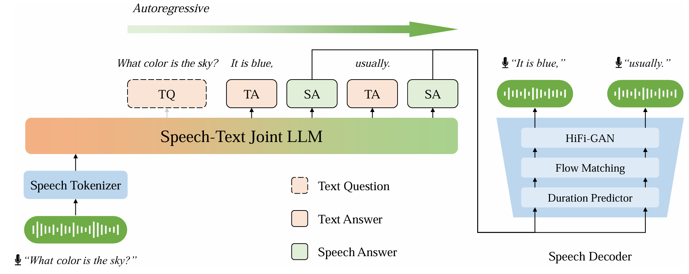

# Efficient Training for Cross-lingual Speech Language Models

> [Yan Zhou](https://zhouyan19.github.io/zhouyan/), [Qingkai Fang](https://fangqingkai.github.io/), [Yun Hong](https://hongyun2002.github.io/), [Yang Feng*](https://people.ucas.edu.cn/~yangfeng)

Source code and resources for our Findings of ACL 2026 paper:
**Efficient Training for Cross-lingual Speech Language Models**.

- Paper (arXiv): [Efficient Training for Cross-lingual Speech Language Models](https://arxiv.org/abs/2604.11096)
- Model Weights (Hugging Face): _TBD (to be released)_
- Evaluation set: `BELLE-eval-S2S` (Chinese speech-to-speech conversation test set)



## 💡 Overview

This repository contains training and inference code for cross-lingual speech language models (CSLM), together with a Chinese S2S conversation benchmark (`BELLE-eval-S2S`) used in our experiments.

The current release includes:
- Pre-training and supervised fine-tuning (SFT) scripts
- Inference scripts for general and cross-lingual decoding
- A public Chinese test set for S2S conversation evaluation

## 🔥 Training

### 1) Pre-training

Edit paths in `cslm/train/pretrain.sh`:
- `DATA_ROOT` / `DATA_PATH`
- `MODEL_DIR`
- `CACHE_DIR`
- `OUT_DIR`
- distributed environment variables (`MASTER_ADDR`, `MASTER_PORT`, etc.) if using multi-node

Then run:

```bash
cd cslm/train
./pretrain.sh
```

### 2) Supervised Fine-tuning (SFT)

Edit paths in `cslm/train/sft.sh`:
- `DATA_ROOT` / `DATA_PATH`
- `MODEL_DIR` (pretrained checkpoint)
- `CACHE_DIR`
- `OUT_DIR`

Then run:

```bash
cd cslm/train
./sft.sh
```

The SFT training code expects JSON/JSONL with fields:

- `prompt`: user input (string or multi-turn list)
- `response`: target response (string or multi-turn list)

Minimal single-turn example:

```json
{"prompt": "你好，请介绍一下你自己。", "response": "你好，我是一个跨语言语音语言模型助手。"}
```

Minimal multi-turn example:

```json
{
  "prompt": ["你好", "请用一句话解释机器学习"],
  "response": ["你好！", "机器学习是让模型从数据中学习规律并用于预测或决策的方法。"]
}
```

## 💭 Inference

Inference scripts take speech unit sequences as input (one unit sequence per line in a text file).

### 1) General Decoding

```bash
cd cslm/infer
python decode_general.py \
  --lang zh \
  --unit /path/to/unit_sequences.txt \
  --model-name-or-path /path/to/checkpoint \
  --output-dir /path/to/output
```

### 2) Cross-lingual Decoding

```bash
cd cslm/infer
python decode_general_cross.py \
  --lang en \
  --unit /path/to/unit_sequences.txt \
  --model-name-or-path /path/to/checkpoint \
  --output-dir /path/to/output
```

Outputs are appended to:
- `/path/to/output/responses.json`

## 🗂️ Dataset

### BELLE-eval-S2S

`BELLE-eval-S2S` is our open Chinese speech-to-speech conversation test set used for evaluation.

- Manifest file: `BELLE-eval-S2S/test.tsv`
- Audio files: `BELLE-eval-S2S/wav`

If you use this benchmark, please cite our paper.

## 🤝 Model and Resource Acknowledgement

This project is built on top of the following open resources:

- Base LLM: [meta-llama/Llama-3.1-8B-Instruct](https://huggingface.co/meta-llama/Llama-3.1-8B-Instruct)
- Speech tokenizer: [FunAudioLLM/CosyVoice-300M](https://huggingface.co/FunAudioLLM/CosyVoice-300M)

Please follow their original licenses and usage policies.

## 📖 Citation

```bibtex
@misc{zhou2026efficienttrainingcrosslingualspeech,
      title={Efficient Training for Cross-lingual Speech Language Models}, 
      author={Yan Zhou and Qingkai Fang and Yun Hong and Yang Feng},
      year={2026},
      eprint={2604.11096},
      archivePrefix={arXiv},
      primaryClass={cs.CL},
      url={https://arxiv.org/abs/2604.11096}, 
}
```

## ✉️ Contact

If you have questions, please contact: `zhouyan23z@ict.ac.cn`.
